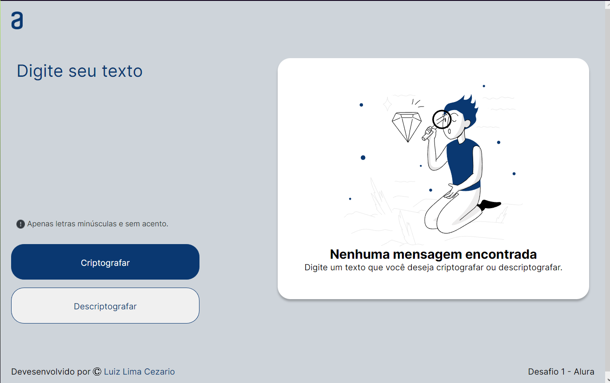
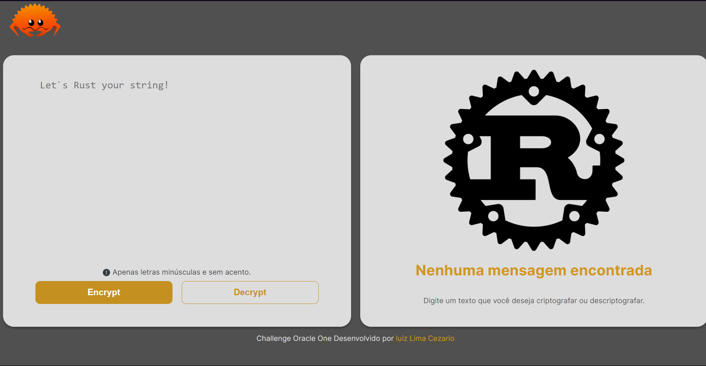

   

  <a aria-label="Completed" href="https://www.oracle.com/br/education/oracle-next-education/">
    </img>
  </a>
   

  

  Challange Descriptor of Oracle One. Made with ❤︎
    </a>
  

# :pushpin: Index

* [What is this Repo?](#sparkles_What-is-this-Repo?)
* [How to test](#clipboard_How-to-test)
* [Technologies](#computer_Technologies)
* [Find a Bug? Or somenthing need to change?](#bug_Issues?)

# :sparkles: What is this Repo?

This is a challenge proposed in the oracle one next education course, in this challenge we have to make a simple site to encrypt and decrypt a text with basic encryption rules, in addition to the basic challenge I decided to use what I learned in the course with what I had been studying abroad and do the same challenge in rust with Yew which is a web framework for Rust similar to javascript react

# :clipboard: How to test

to test this repository just access the pages:

[version Javascript](https://luizlcezario.github.io/OracleOne_Challenge_Encrypt/)

[version Rust](https://luizlcezario.github.io/OracleOne_Challenge_Encrypt/rust/)

if you click in the logo in both pages you will change between then.

## :computer: Technologies

Version Javascript:

Static Web Site with ->
[Javascript](https://developer.mozilla.org/pt-BR/docs/Web/JavaScript)
[HTML5](https://developer.mozilla.org/en-US/docs/Glossary/HTML5)
[CSS3](https://developer.mozilla.org/en-US/docs/Glossary/CSS)

Version Rust:

Static Web Site made with Yew ->
[Rust](https://doc.rust-lang.org/book/)
[Yew](https://yew.rs)
[WebAssembly](https://webassembly.org)
[Trunk](https://trunkrs.dev)

# :bug: Issues?

Please feel free **to create a new issue** with its title and description on the issues page of the [BenchMark](https://github.com/luizlcezario/OracleOne_Challenge_Encrypt/issues) Repository. If you have already found the solution to the problem, **I would love to review your pull request**!

Give ⭐️ if you like this project, this will help me!